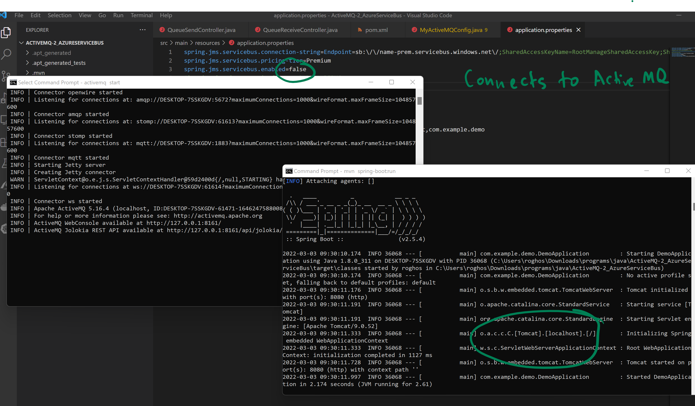

## Migrating JMS code from Active Apache MQ to Azure Service Bus.

1) Add the spring jms service bus module into your project pom.xml

    <!-- Azure Service Bus -->
	<dependency>
    	<groupId>com.azure.spring</groupId>
    	<artifactId>azure-spring-boot-starter-servicebus-jms</artifactId>
    	<version>3.14.0</version>
	</dependency> 
    
2) Add 2 new parameters in your application.properties file

	spring.jms.servicebus.connection-string={Default=....connection string settings}

	spring.jms.servicebus.pricing-tier=Premium

3) Use spring.jms.servicebus.enabled=[true/false] 
if you plan to switch between Service Bus or Active Apache MQ at runtime.
	
	Customers requiring phased approach from On-Prem to Azure Cloud should use this technique.
	
	

Select your newly created resource group. Then click **Create** Or **Create resources** if this is the first resource your are creating
a Cosmos DB may be accomplished via the [Azure Portal](https://docs.microsoft.com/en-us/azure/cosmos-db/create-cosmosdb-resources-portal), or via the [Azure CLI]

Then select on **Create** Azure Cosmos DB. Cosmos provides different flaovors. Please choose the one with SQL

Fill all the parameters as shown
